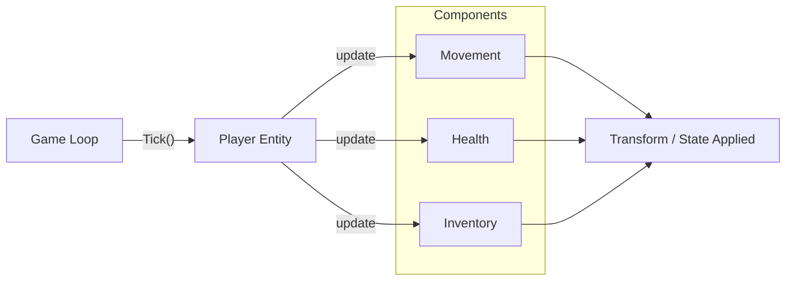

## パターンの一行要約
継承に頼らず、振る舞いを小さな単位に分割して合成することでエンティティを構築するパターンです。

## Unityでの典型的な使用例
- キャラクターの機能を柔軟に組み合わせる必要がある場合。
- 実行時に機能を有効化・無効化できる設計が必要な場合。

## 構成要素（役割）
- Entity: コンポーネントのコンテナ
- Component: 振る舞いの独立した単位
- Composer: 初期構成のセットアップ

## Unityサンプル（C#）
以下のコードは、上で説明したシナリオに基づいた簡略化されたUnityのサンプルです。

```csharp
using System.Collections.Generic;
using UnityEngine;

public interface IGameComponent
{
    void Tick(float deltaTime);
}

public sealed class MovementComponent : IGameComponent
{
    private readonly Transform targetTransform;
    private readonly float moveSpeed;

    public MovementComponent(Transform targetTransform, float moveSpeed)
    {
        this.targetTransform = targetTransform;
        this.moveSpeed = moveSpeed;
    }

    public void Tick(float deltaTime)
    {
        targetTransform.position += Vector3.forward * moveSpeed * deltaTime;
    }
}

public sealed class CharacterControllerRoot : MonoBehaviour
{
    private readonly List<IGameComponent> components = new();

    private void Awake()
    {
        components.Add(new MovementComponent(transform, 5f));
    }
}
```

## 利点
- 機能をモジュール単位に分割でき、キャラクターやオブジェクトのバリエーションを素早く作成できます。
- 個々のコンポーネントを単体でテストしたり差し替えたりできるため、回帰範囲が小さく保たれます。

## 注意点
- コンポーネント間の依存が増えると、新たな結合が再び現れます。
- 更新ループが多くのコンポーネントに分散すると、呼び出しオーバーヘッドとデバッグの難しさが増します。

## 相互作用図

エンティティが複数のコンポーネントを組み合わせて最終的な状態を生成する流れを示します。


