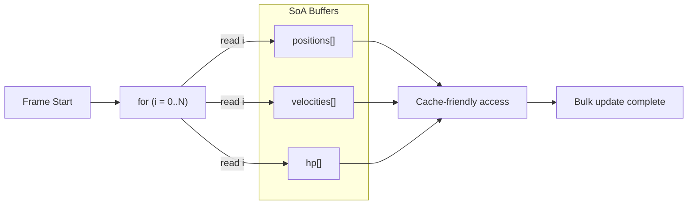

## One-line pattern summary
A performance-oriented pattern that places frequently accessed data in contiguous memory to improve cache efficiency.

## Typical Unity use cases
- When updating a large number of objects such as bullets or particles every frame.
- When CPU bottlenecks need to be reduced.

## Parts (roles)
- Hot Data: frequently accessed values
- Contiguous Storage: sequential arrays
- Loop: simple repetitive processing

## Unity example (C#)
The code below is a simplified Unity example based on the scenario described above.

```csharp
using UnityEngine;

public struct ProjectileState
{
    public Vector3 Position;
    public Vector3 Velocity;
}

public static class ProjectileSimulation
{
    public static void Simulate(ProjectileState[] projectileStates, float deltaTime)
    {
        for (int projectileIndex = 0; projectileIndex < projectileStates.Length; projectileIndex++)
        {
            projectileStates[projectileIndex].Position += projectileStates[projectileIndex].Velocity * deltaTime;
        }
    }
}
```

## Advantages
- Sequential memory access reduces cache misses and improves throughput for large-scale calculations.
- It becomes especially powerful when combined with data-oriented systems such as Burst and Jobs.

## Things to watch out for
- If the structure is optimized too heavily for performance, readability and domain clarity can suffer.
- Mistakes in array synchronization and index management can easily cause data mismatch bugs.

## Interaction diagram

This shows the flow where contiguous memory blocks are processed sequentially to improve cache efficiency.


