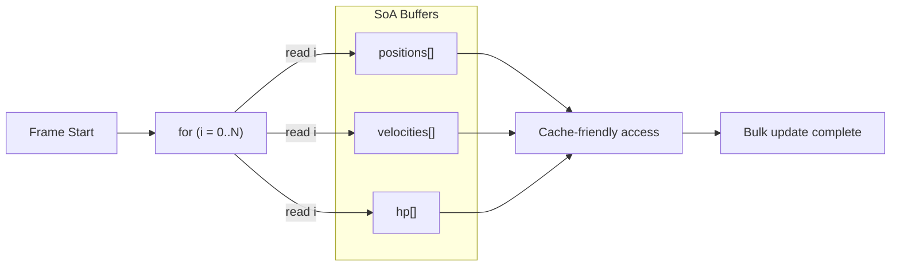

## パターンの一行要約
頻繁にアクセスするデータを連続したメモリに配置し、キャッシュ効率を向上させるパフォーマンス指向のパターンです。

## Unityでの典型的な使用例
- 弾やパーティクルなど、毎フレーム大量のオブジェクトを更新する場合。
- CPUのボトルネックを軽減する必要がある場合。

## 構成要素（役割）
- Hot Data: 頻繁にアクセスする値
- Contiguous Storage: 連続した配列
- Loop: 単純な繰り返し処理

## Unityサンプル（C#）
以下のコードは、上で説明したシナリオに基づいた簡略化されたUnityのサンプルです。

```csharp
using UnityEngine;

public struct ProjectileState
{
    public Vector3 Position;
    public Vector3 Velocity;
}

public static class ProjectileSimulation
{
    public static void Simulate(ProjectileState[] projectileStates, float deltaTime)
    {
        for (int projectileIndex = 0; projectileIndex < projectileStates.Length; projectileIndex++)
        {
            projectileStates[projectileIndex].Position += projectileStates[projectileIndex].Velocity * deltaTime;
        }
    }
}
```

## 利点
- 連続したメモリアクセスによってキャッシュミスが減り、大規模な計算のスループットが向上します。
- BurstやJobsなどのデータ指向システムと組み合わせると、特に強力になります。

## 注意点
- 構造をパフォーマンスに最適化しすぎると、可読性やドメインの明瞭さが損なわれることがあります。
- 配列の同期やインデックス管理を誤ると、データ不整合のバグが発生しやすくなります。

## 相互作用図

連続したメモリブロックを順次処理し、キャッシュ効率を高める流れを示します。


