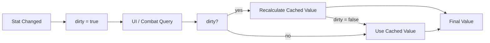

## One-line pattern summary
A lazy update pattern that marks expensive calculations so they are recomputed only when the underlying value changes.

## Typical Unity use cases
- When stat aggregation or layout calculation is expensive.
- When recalculating every frame is unnecessary.

## Parts (roles)
- Primary Data: source data
- Dirty Flag: whether recalculation is needed
- Cache: computed result

## Unity example (C#)
The code below is a simplified Unity example based on the scenario described above.

```csharp
public sealed class PlayerAttackStat
{
    private int baseAttackPower;
    private int equipmentBonusPower;
    private bool needsRecalculation = true;
    private int cachedAttackPower;

    public void SetBaseAttackPower(int value)
    {
        baseAttackPower = value;
        needsRecalculation = true;
    }

    public void SetEquipmentBonusPower(int value)
    {
        equipmentBonusPower = value;
        needsRecalculation = true;
    }

    public int GetFinalAttackPower()
    {
        if (!needsRecalculation)
        {
            return cachedAttackPower;
        }
        cachedAttackPower = baseAttackPower + equipmentBonusPower;
        needsRecalculation = false;
        return cachedAttackPower;
    }
}
```

## Advantages
- It reduces unnecessary work per frame by calculating only when the value actually changes.
- It is especially effective for values that do not change often, such as UI, stats, or transforms.

## Things to watch out for
- If the flag update is missed, bugs appear where stale data is used.
- When dependencies become complex, it becomes difficult to track which change should set the flag.

## Interaction diagram

This shows the lazy update flow where recalculation happens only when a value changes.


