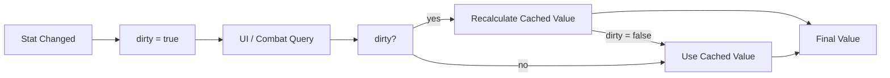

## パターンの一行要約
高コストな計算にマークを付けておき、元の値が変化したときだけ再計算する遅延更新パターンです。

## Unityでの典型的な使用例
- ステータス集計やレイアウト計算が高コストな場合。
- 毎フレームの再計算が不要な場合。

## 構成要素（役割）
- Primary Data: 元データ
- Dirty Flag: 再計算が必要かどうか
- Cache: 計算結果

## Unityサンプル（C#）
以下のコードは、上で説明したシナリオに基づいた簡略化されたUnityのサンプルです。

```csharp
public sealed class PlayerAttackStat
{
    private int baseAttackPower;
    private int equipmentBonusPower;
    private bool needsRecalculation = true;
    private int cachedAttackPower;

    public void SetBaseAttackPower(int value)
    {
        baseAttackPower = value;
        needsRecalculation = true;
    }

    public void SetEquipmentBonusPower(int value)
    {
        equipmentBonusPower = value;
        needsRecalculation = true;
    }

    public int GetFinalAttackPower()
    {
        if (!needsRecalculation)
        {
            return cachedAttackPower;
        }
        cachedAttackPower = baseAttackPower + equipmentBonusPower;
        needsRecalculation = false;
        return cachedAttackPower;
    }
}
```

## 利点
- 値が実際に変わったときだけ計算するため、フレームごとの不要な処理を減らせます。
- UI、ステータス、トランスフォームなど、頻繁に変わらない値に対して特に効果的です。

## 注意点
- フラグの更新を忘れると、古いデータが使われるバグが発生します。
- 依存関係が複雑になると、どの変更でフラグを立てるべきかを追跡するのが難しくなります。

## 相互作用図

値が変化したときだけ再計算が行われる遅延更新の流れを示します。


