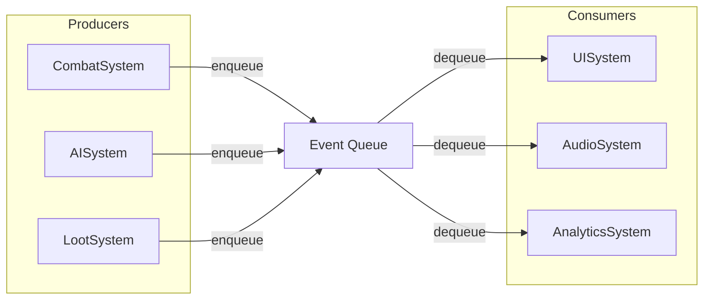

## One-line pattern summary
A pattern that lowers coupling between systems by separating event publishing and consuming through a queue.

## Typical Unity use cases
- When combat events need to be delivered to UI, audio, and rewards at the same time.
- When you want to reduce tight coupling caused by immediate direct calls.

## Parts (roles)
- Publisher: event producer
- Queue: event storage
- Consumer: frame-based processor

## Unity example (C#)
The code below is a simplified Unity example based on the scenario described above.

```csharp
using System.Collections.Generic;
using UnityEngine;

public readonly struct CombatEvent
{
    public readonly string EventType;
    public readonly int Value;

    public CombatEvent(string eventType, int value)
    {
        EventType = eventType;
        Value = value;
    }
}

public sealed class CombatEventQueue : MonoBehaviour
{
    private readonly Queue<CombatEvent> pendingEvents = new();

    public void Publish(CombatEvent combatEvent)
    {
        pendingEvents.Enqueue(combatEvent);
    }

    private void Update()
    {
        while (pendingEvents.Count > 0)
        {
            CombatEvent combatEvent = pendingEvents.Dequeue();
            Debug.Log($"${combatEvent.EventType}: ${combatEvent.Value}");
        }
    }
}
```

## Advantages
- It separates producer and consumer timing, reducing direct dependencies between systems.
- It makes extensions such as event logging, replay, and batch processing easier.

## Things to watch out for
- If the queue backs up, responsiveness can drop because of added latency.
- If ordering and duplication rules are not defined clearly, hard-to-reproduce bugs can appear.

## Interaction diagram

This shows the asynchronous flow where producers and consumers are separated by a queue.


