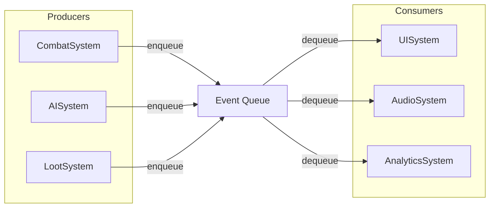

## パターンの一行要約
イベントの発行と消費をキューで分離することで、システム間の結合度を下げるパターンです。

## Unityでの典型的な使用例
- 戦闘イベントをUI、サウンド、報酬に同時に伝える必要がある場合。
- 即時の直接呼び出しによる強い結合を減らしたい場合。

## 構成要素（役割）
- Publisher: イベントの発行者
- Queue: イベントの保管場所
- Consumer: フレーム単位の処理者

## Unityサンプル（C#）
以下のコードは、上で説明したシナリオに基づいた簡略化されたUnityのサンプルです。

```csharp
using System.Collections.Generic;
using UnityEngine;

public readonly struct CombatEvent
{
    public readonly string EventType;
    public readonly int Value;

    public CombatEvent(string eventType, int value)
    {
        EventType = eventType;
        Value = value;
    }
}

public sealed class CombatEventQueue : MonoBehaviour
{
    private readonly Queue<CombatEvent> pendingEvents = new();

    public void Publish(CombatEvent combatEvent)
    {
        pendingEvents.Enqueue(combatEvent);
    }

    private void Update()
    {
        while (pendingEvents.Count > 0)
        {
            CombatEvent combatEvent = pendingEvents.Dequeue();
            Debug.Log($"${combatEvent.EventType}: ${combatEvent.Value}");
        }
    }
}
```

## 利点
- 発行者と消費者のタイミングを分離し、システム間の直接的な依存関係を減らせます。
- イベントログ、リプレイ、バッチ処理などの拡張が容易になります。

## 注意点
- キューが滞留すると、レイテンシの増加によって応答性が低下する可能性があります。
- 順序や重複のルールを明確に定義しないと、再現が難しいバグが発生することがあります。

## 相互作用図

発行者と消費者がキューによって分離される非同期な流れを示します。


