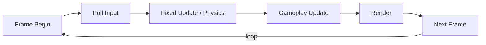

## パターンの一行要約
入力・更新・描画のループを安定して維持する、ゲームの中核となる実行パターンです。

## Unityでの典型的な使用例
- 固定ステップのシミュレーションを実装する場合。
- 入力タイミングと描画タイミングを分離する必要がある場合。

## 構成要素（役割）
- Input Step
- Simulate Step
- Render Step

## Unityサンプル（C#）
以下のコードは、上で説明したシナリオに基づいた簡略化されたUnityのサンプルです。

```csharp
using UnityEngine;

public sealed class FixedStepLoop : MonoBehaviour
{
    private const float SimulationStep = 1f / 60f;
    private float accumulatedDeltaTime;

    private void Update()
    {
        accumulatedDeltaTime += Time.deltaTime;
        while (accumulatedDeltaTime >= SimulationStep)
        {
            Simulate(SimulationStep);
            accumulatedDeltaTime -= SimulationStep;
        }
        float interpolationAlpha = accumulatedDeltaTime / SimulationStep;
        Render(interpolationAlpha);
    }

    private void Simulate(float deltaTime) { }

    private void Render(float interpolationAlpha) { }
}
```

## 利点
- 更新順序が固定されることで、シミュレーションの再現性が向上し、デバッグが安全になります。
- 固定ステップ更新と補間を分離することで、物理精度と描画の滑らかさのバランスを取れます。

## 注意点
- 重いフレームでは`while`ループが長くなりすぎ、スパイラル・オブ・デスを引き起こす可能性があります。
- `Update`と`FixedUpdate`の責務が混在すると、入力レイテンシや物理の誤差が増加します。

## 相互作用図

フレーム単位で入力、シミュレーション、描画を繰り返すメインループです。


