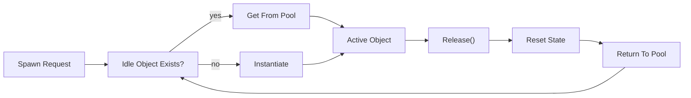

## One-line pattern summary
A pattern that reuses frequently created and destroyed objects to reduce allocation cost and GC spikes.

## Typical Unity use cases
- When spawning and removing a lot of bullets or effects.
- When GC spikes on mobile need to be reduced.

## Parts (roles)
- Pool: reusable storage
- Get: checkout
- Release: return

## Unity example (C#)
The code below is a simplified Unity example based on the scenario described above.

```csharp
using UnityEngine;
using UnityEngine.Pool;

public sealed class ProjectilePoolController : MonoBehaviour
{
    [SerializeField] private GameObject projectilePrefab;
    private ObjectPool<GameObject> projectilePool;

    private void Awake()
    {
        projectilePool = new ObjectPool<GameObject>(
            createFunc: () => Instantiate(projectilePrefab),
            actionOnGet: projectile => projectile.SetActive(true),
            actionOnRelease: projectile => projectile.SetActive(false),
            actionOnDestroy: projectile => Destroy(projectile),
            collectionCheck: false,
            defaultCapacity: 32,
            maxSize: 256
        );
    }

    public GameObject SpawnProjectile(Vector3 spawnPosition)
    {
        GameObject projectile = projectilePool.Get();
        projectile.transform.position = spawnPosition;
        return projectile;
    }
}
```

## Advantages
- It reduces Instantiate/Destroy frequency, which lowers GC spikes and hitching.
- Since the maximum object count can be controlled, performance budgeting becomes easier.

## Things to watch out for
- If return calls are missed, pool exhaustion or unnecessary memory growth can happen.
- If reused objects are not reset properly, data from previous frames can leak into the next use.

## Interaction diagram

This shows the pool management flow that reduces allocations by reusing objects.


