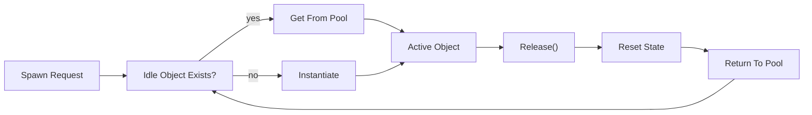

## パターンの一行要約
頻繁に生成・破棄されるオブジェクトを再利用し、確保コストとGCスパイクを削減するパターンです。

## Unityでの典型的な使用例
- 弾やエフェクトを大量に生成・削除する場合。
- モバイルでのGCスパイクを削減する必要がある場合。

## 構成要素（役割）
- Pool: 再利用可能なストレージ
- Get: 取り出し
- Release: 返却

## Unityサンプル（C#）
以下のコードは、上で説明したシナリオに基づいた簡略化されたUnityのサンプルです。

```csharp
using UnityEngine;
using UnityEngine.Pool;

public sealed class ProjectilePoolController : MonoBehaviour
{
    [SerializeField] private GameObject projectilePrefab;
    private ObjectPool<GameObject> projectilePool;

    private void Awake()
    {
        projectilePool = new ObjectPool<GameObject>(
            createFunc: () => Instantiate(projectilePrefab),
            actionOnGet: projectile => projectile.SetActive(true),
            actionOnRelease: projectile => projectile.SetActive(false),
            actionOnDestroy: projectile => Destroy(projectile),
            collectionCheck: false,
            defaultCapacity: 32,
            maxSize: 256
        );
    }

    public GameObject SpawnProjectile(Vector3 spawnPosition)
    {
        GameObject projectile = projectilePool.Get();
        projectile.transform.position = spawnPosition;
        return projectile;
    }
}
```

## 利点
- Instantiate/Destroyの頻度が減り、GCスパイクやヒッチを抑えられます。
- 最大オブジェクト数を制御できるため、パフォーマンスバジェットの管理が容易になります。

## 注意点
- 返却の呼び出しを忘れると、プールの枯渇や不要なメモリ増加が発生する可能性があります。
- 再利用するオブジェクトを適切にリセットしないと、前フレームのデータが次の使用に漏れることがあります。

## 相互作用図

オブジェクトを再利用して確保を減らす、プール管理の流れを示します。


