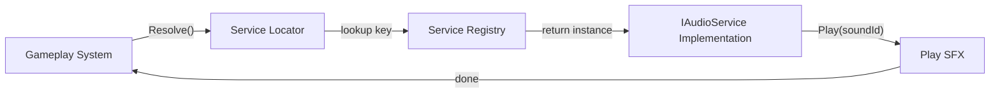

## パターンの一行要約
共有サービスへのアクセスを中央のレジストリに集約し、呼び出し側の結合度を下げるパターンです。

## Unityでの典型的な使用例
- オーディオ、セーブ、アナリティクスなどのサービスをグローバルに参照する場合。
- 開発初期段階でDIをシンプルに済ませたい場合。

## 構成要素（役割）
- Service Interface
- Locator Registry
- Bootstrap Registration

## Unityサンプル（C#）
以下のコードは、上で説明したシナリオに基づいた簡略化されたUnityのサンプルです。

```csharp
public interface IAudioService
{
    void PlaySfx(string clipId);
}

public static class GameServices
{
    public static IAudioService AudioService { get; private set; }

    public static void RegisterAudioService(IAudioService audioService)
    {
        AudioService = audioService;
    }
}

public sealed class DamageFeedbackSystem
{
    public void OnHit()
    {
        GameServices.AudioService?.PlaySfx("Hit");
    }
}
```

## 利点
- 共有サービスを一箇所で差し替えたり注入したりできるため、開発初期のスピードが上がります。
- 呼び出し側が生成責任を持たなくなるので、利用コードがシンプルになります。

## 注意点
- 隠れたグローバル依存により、テストの分離や依存関係の追跡が難しくなります。
- 初期化順序を誤ると、実行時にnull参照エラーが発生しやすくなります。

## 相互作用図

クライアントがインターフェースをキーとしてサービスを検索し、利用する流れを示します。


