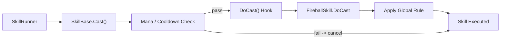

## パターンの一行要約
親クラスが安全な拡張APIを提供し、子クラスはその範囲内でのみ実装するよう制限するパターンです。

## Unityでの典型的な使用例
- コアルールを保護しつつ、スキルやAIを拡張する場合。
- 企画者向けの拡張ポイントを制御したい場合。

## 構成要素（役割）
- Base Class: 安全なAPIを提供
- Hook: 子クラスの実装ポイント
- Subclass: 拡張実装

## Unityサンプル（C#）
以下のコードは、上で説明したシナリオに基づいた簡略化されたUnityのサンプルです。

```csharp
public abstract class SkillBase
{
    public void ExecuteSkill()
    {
        if (!CanExecute())
        {
            return;
        }
        ConsumeResource();
        PlayCastAnimation();
        ApplyEffect();
    }

    protected virtual bool CanExecute() => true;

    protected virtual void ConsumeResource() { }

    protected virtual void PlayCastAnimation() { }

    protected abstract void ApplyEffect();
}

public sealed class FireballSkill : SkillBase
{
    protected override void ApplyEffect()
    {
        // Spawn fireball projectile.
    }
}
```

## 利点
- 親クラスが許可するAPIだけが公開されるため、拡張コードを安全に制約できます。
- クールダウンやリソースコストなど、共通ルールを基底クラスで強制したいときに有効です。

## 注意点
- 基底クラスが大きくなりすぎると、かえって拡張の柔軟性が低下する可能性があります。
- フックの契約が曖昧だと、サブクラス間で動作の一貫性が崩れることがあります。

## 相互作用図

親のテンプレートが共通ルールを強制し、子クラスはフックのみを実装する流れを示します。


