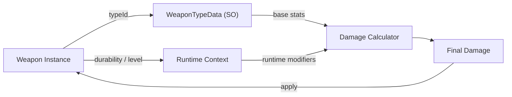

## One-line pattern summary
A pattern that models object types as data rather than classes so that extension can be handled by adding new data.

## Typical Unity use cases
- When increasing weapon or monster types without modifying code.
- When balancing values are managed as planning data.

## Parts (roles)
- Type Data: ScriptableObject / table
- Runtime Instance: object that references the type
- Registry: type lookup

## Unity example (C#)
The code below is a simplified Unity example based on the scenario described above.

```csharp
using UnityEngine;

[CreateAssetMenu(menuName = "Game/Weapon Type Data")]
public sealed class WeaponTypeData : ScriptableObject
{
    public string weaponId;
    public int attackPower;
    public float cooldownSeconds;
}

public sealed class WeaponRuntime
{
    private readonly WeaponTypeData weaponTypeData;

    public WeaponRuntime(WeaponTypeData weaponTypeData)
    {
        this.weaponTypeData = weaponTypeData;
    }

    public int AttackPower => weaponTypeData.attackPower;
}
```

## Advantages
- New types can be added through data such as ScriptableObjects without changing code.
- Planning and balancing work can be separated from code deployment, which improves iteration speed.

## Things to watch out for
- If the data schema changes frequently, migration and compatibility costs can grow quickly.
- Missing runtime references may stay quiet in the editor but break in actual builds.

## Interaction diagram

This shows the flow where an instance references type data to decide its behavior.


