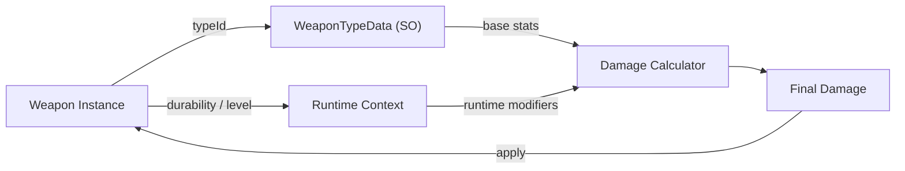

## パターンの一行要約
オブジェクトの型をクラスではなくデータとしてモデル化し、新しいデータの追加で拡張できるようにするパターンです。

## Unityでの典型的な使用例
- コードを変更せずに武器やモンスターの種類を増やす場合。
- バランス調整値を企画データとして管理する場合。

## 構成要素（役割）
- Type Data: ScriptableObject / テーブル
- Runtime Instance: 型を参照するオブジェクト
- Registry: 型の検索

## Unityサンプル（C#）
以下のコードは、上で説明したシナリオに基づいた簡略化されたUnityのサンプルです。

```csharp
using UnityEngine;

[CreateAssetMenu(menuName = "Game/Weapon Type Data")]
public sealed class WeaponTypeData : ScriptableObject
{
    public string weaponId;
    public int attackPower;
    public float cooldownSeconds;
}

public sealed class WeaponRuntime
{
    private readonly WeaponTypeData weaponTypeData;

    public WeaponRuntime(WeaponTypeData weaponTypeData)
    {
        this.weaponTypeData = weaponTypeData;
    }

    public int AttackPower => weaponTypeData.attackPower;
}
```

## 利点
- ScriptableObjectなどのデータを通じて、コードを変更せずに新しい型を追加できます。
- 企画やバランス調整作業をコードのデプロイから切り離せるため、イテレーション速度が向上します。

## 注意点
- データスキーマが頻繁に変わると、移行や互換性のコストが急速に増加する可能性があります。
- ランタイム参照の欠落はエディタでは表面化しないものの、実機ビルドで壊れることがあります。

## 相互作用図

インスタンスが型データを参照して動作を決定する流れを示します。


