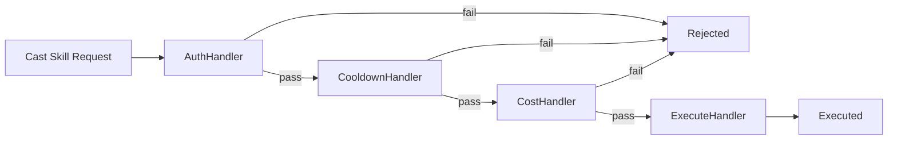

# Chain of Responsibility

## パターンの一行要約
リクエストをハンドラーのチェーンに沿って渡し、各ハンドラーが順番に責任を遂行するパターン。

## Unityでの典型的な使用例
- ダメージ計算で、シールド・バフ・耐性を順番に適用する必要がある場合。
- 入力フィルタを段階的に処理する必要がある場合。

## 構成要素（役割）
- Handler
- Concrete Handler
- Next Handler

## Unityサンプル（C#）
以下のコードは、上記のシナリオを基にした簡略化された Unity の例です。

```csharp
public abstract class DamageModifierHandler
{
    private DamageModifierHandler nextHandler;

    public DamageModifierHandler SetNext(DamageModifierHandler nextHandler)
    {
        this.nextHandler = nextHandler;
        return nextHandler;
    }

    public int Handle(int incomingDamage)
    {
        int updatedDamage = ModifyDamage(incomingDamage);
        return nextHandler == null ? updatedDamage : nextHandler.Handle(updatedDamage);
    }

    protected abstract int ModifyDamage(int incomingDamage);
}

public sealed class ShieldDamageHandler : DamageModifierHandler
{
    protected override int ModifyDamage(int incomingDamage)
    {
        return System.Math.Max(0, incomingDamage - 20);
    }
}
```

## 利点
- 振る舞いが小さな単位に分離されるため、変更の影響範囲を抑えられます。
- ルールの追加や差し替えが比較的安全に行えます。

## 注意点
- オブジェクト数や間接呼び出しが増えると、フローを追いにくくなります。
- 順序に関するバグはテストで確実に固めておくべきです。

## 相互作用図

リクエストがチェーンを通過し、各ハンドラーが可能であれば責任を引き受けるフローを示します。


