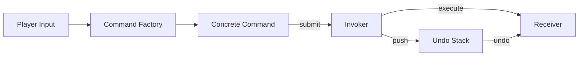

## One-line pattern summary
A pattern that turns requests into objects and handles execution, undo, and queueing flexibly.

## Typical Unity use cases
- When implementing input replay or macros.
- When Undo / Redo support is needed.

## Parts (roles)
- Command
- Invoker
- Receiver

## Unity example (C#)
The code below is a simplified Unity example based on the scenario described above.

```csharp
using System.Collections.Generic;

public interface ICommand
{
    void Execute();
    void Undo();
}

public sealed class MoveUnitCommand : ICommand
{
    private readonly Unit controlledUnit;
    private readonly int deltaX;

    public MoveUnitCommand(Unit controlledUnit, int deltaX)
    {
        this.controlledUnit = controlledUnit;
        this.deltaX = deltaX;
    }

    public void Execute() => controlledUnit.X += deltaX;
    public void Undo() => controlledUnit.X -= deltaX;
}

public sealed class CommandHistory
{
    private readonly Stack<ICommand> executedCommands = new();

    public void ExecuteCommand(ICommand command)
    {
        command.Execute();
        executedCommands.Push(command);
    }
}
```

## Advantages
- Behavior is separated into smaller units, which reduces the impact of changes.
- Adding or swapping rules is relatively safe.

## Things to watch out for
- As the number of objects and indirect calls increases, the flow can become harder to follow.
- Ordering bugs should be pinned down with tests.

## Interaction diagram

This shows the flow where requests are encapsulated as objects so execution, queueing, and undo can be separated.


