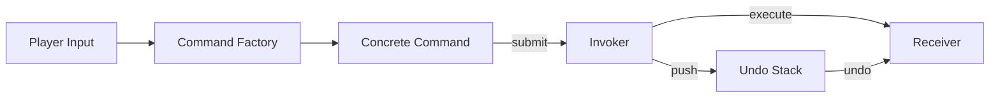

## パターンの一行要約
リクエストをオブジェクト化し、実行・取り消し・キューイングを柔軟に扱うパターン。

## Unityでの典型的な使用例
- 入力リプレイやマクロを実装する場合。
- Undo / Redo のサポートが必要な場合。

## 構成要素（役割）
- Command
- Invoker
- Receiver

## Unityサンプル（C#）
以下のコードは、上記のシナリオを基にした簡略化された Unity の例です。

```csharp
using System.Collections.Generic;

public interface ICommand
{
    void Execute();
    void Undo();
}

public sealed class MoveUnitCommand : ICommand
{
    private readonly Unit controlledUnit;
    private readonly int deltaX;

    public MoveUnitCommand(Unit controlledUnit, int deltaX)
    {
        this.controlledUnit = controlledUnit;
        this.deltaX = deltaX;
    }

    public void Execute() => controlledUnit.X += deltaX;
    public void Undo() => controlledUnit.X -= deltaX;
}

public sealed class CommandHistory
{
    private readonly Stack<ICommand> executedCommands = new();

    public void ExecuteCommand(ICommand command)
    {
        command.Execute();
        executedCommands.Push(command);
    }
}
```

## 利点
- 振る舞いが小さな単位に分離されるため、変更の影響範囲を抑えられます。
- ルールの追加や差し替えが比較的安全に行えます。

## 注意点
- オブジェクト数や間接呼び出しが増えると、フローを追いにくくなります。
- 順序に関するバグはテストで確実に固めておくべきです。

## 相互作用図

リクエストをオブジェクトとしてカプセル化し、実行・キューイング・取り消しを分離するフローを示します。


