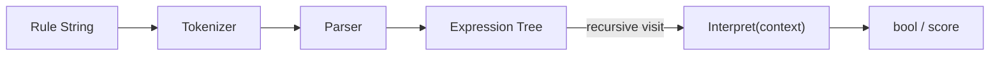

## パターンの一行要約
小さなドメイン言語のルールを文法オブジェクトを通じて解釈し、結果を計算するパターン。

## Unityでの典型的な使用例
- クエスト条件 DSL を構築する場合。
- 会話の分岐条件をデータ駆動にしたい場合。

## 構成要素（役割）
- Expression
- Terminal
- Nonterminal
- Context

## Unityサンプル（C#）
以下のコードは、上記のシナリオを基にした簡略化された Unity の例です。

```csharp
public interface IConditionExpression
{
    bool Evaluate(PlayerContext context);
}

public sealed class LevelAtLeastExpression : IConditionExpression
{
    private readonly int requiredLevel;

    public LevelAtLeastExpression(int requiredLevel)
    {
        this.requiredLevel = requiredLevel;
    }

    public bool Evaluate(PlayerContext context)
    {
        return context.PlayerLevel >= requiredLevel;
    }
}

public sealed class AndExpression : IConditionExpression
{
    private readonly IConditionExpression leftExpression;
    private readonly IConditionExpression rightExpression;

    public AndExpression(IConditionExpression leftExpression, IConditionExpression rightExpression)
    {
        this.leftExpression = leftExpression;
        this.rightExpression = rightExpression;
    }

    public bool Evaluate(PlayerContext context)
    {
        return leftExpression.Evaluate(context) && rightExpression.Evaluate(context);
    }
}
```

## 利点
- 振る舞いが小さな単位に分離されるため、変更の影響範囲を抑えられます。
- ルールの追加や差し替えが比較的安全に行えます。

## 注意点
- オブジェクト数や間接呼び出しが増えると、フローを追いにくくなります。
- 順序に関するバグはテストで確実に固めておくべきです。

## 相互作用図

文法ルールを式ツリーとして解釈し、結果を計算するフローを示します。


