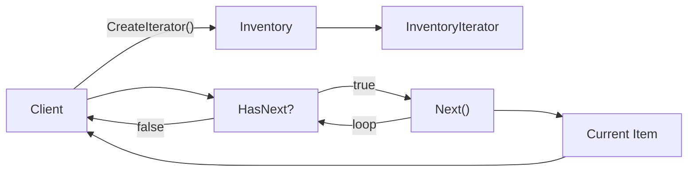

## パターンの一行要約
コレクションの内部構造を隠し、走査する手段だけを公開するパターン。

## Unityでの典型的な使用例
- インベントリやクエストリストを一貫した方法で走査したい場合。
- コレクション実装の変更による影響を抑えたい場合。

## 構成要素（役割）
- Aggregate
- Iterator
- Client

## Unityサンプル（C#）
以下のコードは、上記のシナリオを基にした簡略化された Unity の例です。

```csharp
using System.Collections;
using System.Collections.Generic;

public sealed class InventoryCollection : IEnumerable<InventoryItem>
{
    private readonly List<InventoryItem> items = new();

    public void Add(InventoryItem item)
    {
        items.Add(item);
    }

    public IEnumerator<InventoryItem> GetEnumerator()
    {
        foreach (InventoryItem item in items)
        {
            yield return item;
        }
    }

    IEnumerator IEnumerable.GetEnumerator() => GetEnumerator();
}
```

## 利点
- 振る舞いが小さな単位に分離されるため、変更の影響範囲を抑えられます。
- ルールの追加や差し替えが比較的安全に行えます。

## 注意点
- オブジェクト数や間接呼び出しが増えると、フローを追いにくくなります。
- 順序に関するバグはテストで確実に固めておくべきです。

## 相互作用図

内部表現を露出せずに順次アクセスを提供するフローを示します。


