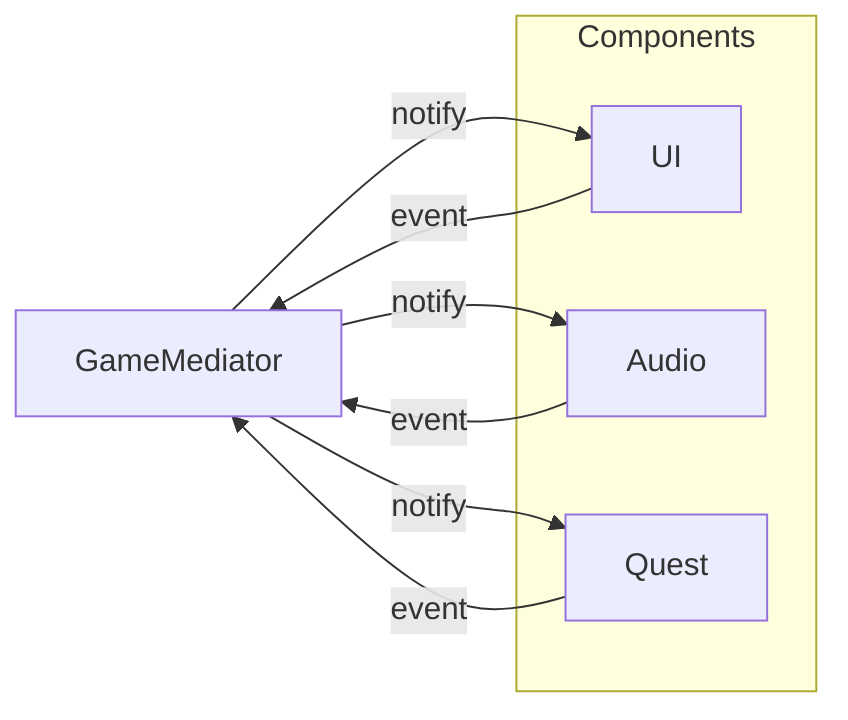

## One-line pattern summary
A pattern that collects interactions between many objects into a mediator so direct dependencies between objects are reduced.

## Typical Unity use cases
- When centrally controlling inventory, equipment, and shop UI interactions.
- When mutual references start becoming too complex.

## Parts (roles)
- Mediator
- Concrete Mediator
- Colleague

## Unity example (C#)
The code below is a simplified Unity example based on the scenario described above.

```csharp
public interface IUiMediator
{
    void Notify(object sender, string eventId);
}

public sealed class LobbyUiMediator : IUiMediator
{
    public InventoryPanel InventoryPanel { get; set; }
    public EquipmentPanel EquipmentPanel { get; set; }

    public void Notify(object sender, string eventId)
    {
        if (sender == InventoryPanel && eventId == "ItemSelected")
        {
            EquipmentPanel.PreviewSelectedItem();
        }
    }
}
```

## Advantages
- Behavior is separated into smaller units, which reduces the impact of changes.
- Adding or swapping rules is relatively safe.

## Things to watch out for
- As the number of objects and indirect calls increases, the flow can become harder to follow.
- Ordering bugs should be pinned down with tests.

## Interaction diagram

This shows the flow where a mediator routes communication instead of components talking directly.


