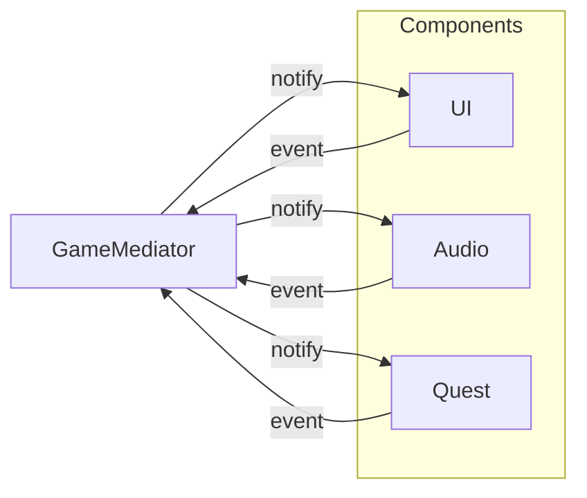

## パターンの一行要約
多数のオブジェクト間のやり取りを Mediator にまとめ、オブジェクト同士の直接的な依存を減らすパターン。

## Unityでの典型的な使用例
- インベントリ、装備、ショップ UI のやり取りを中央集権的に制御する場合。
- 相互参照が複雑になり始めた場合。

## 構成要素（役割）
- Mediator
- Concrete Mediator
- Colleague

## Unityサンプル（C#）
以下のコードは、上記のシナリオを基にした簡略化された Unity の例です。

```csharp
public interface IUiMediator
{
    void Notify(object sender, string eventId);
}

public sealed class LobbyUiMediator : IUiMediator
{
    public InventoryPanel InventoryPanel { get; set; }
    public EquipmentPanel EquipmentPanel { get; set; }

    public void Notify(object sender, string eventId)
    {
        if (sender == InventoryPanel && eventId == "ItemSelected")
        {
            EquipmentPanel.PreviewSelectedItem();
        }
    }
}
```

## 利点
- 振る舞いが小さな単位に分離されるため、変更の影響範囲を抑えられます。
- ルールの追加や差し替えが比較的安全に行えます。

## 注意点
- オブジェクト数や間接呼び出しが増えると、フローを追いにくくなります。
- 順序に関するバグはテストで確実に固めておくべきです。

## 相互作用図

コンポーネント同士が直接通信する代わりに、Mediator が通信を中継するフローを示します。


