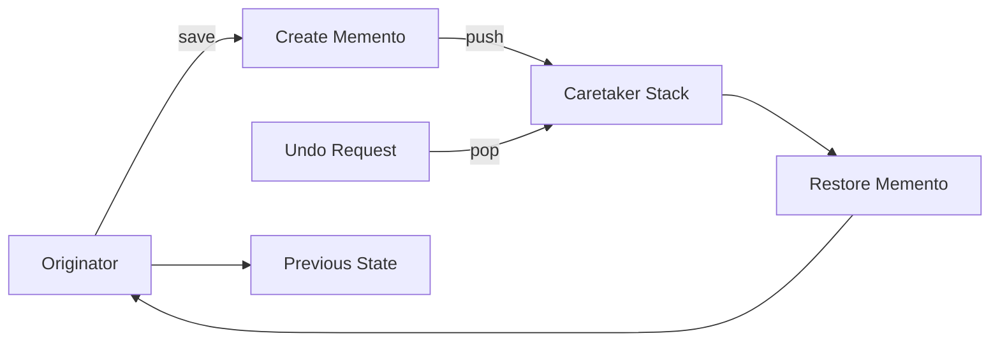

## パターンの一行要約
オブジェクトの内部状態をカプセル化されたスナップショットとして保存・復元するパターン。

## Unityでの典型的な使用例
- チェックポイントへのロールバックを実装する場合。
- Undo / Redo をサポートする場合。

## 構成要素（役割）
- Originator
- Memento
- Caretaker

## Unityサンプル（C#）
以下のコードは、上記のシナリオを基にした簡略化された Unity の例です。

```csharp
using System.Collections.Generic;
using UnityEngine;

public readonly struct PlayerStateSnapshot
{
    public readonly Vector3 Position;
    public readonly int Health;

    public PlayerStateSnapshot(Vector3 position, int health)
    {
        Position = position;
        Health = health;
    }
}

public sealed class PlayerStateHistory
{
    private readonly Stack<PlayerStateSnapshot> snapshots = new();

    public void Save(PlayerStateSnapshot snapshot) => snapshots.Push(snapshot);
    public bool TryRestore(out PlayerStateSnapshot snapshot) => snapshots.TryPop(out snapshot);
}
```

## 利点
- 内部の詳細を露出せずに、状態の保存・復元ロジックを分離できます。
- チェックポイントや履歴ベースのシステムと相性が良いです。

## 注意点
- 状態が大きい場合、スナップショットデータが急速に肥大化することがあります。
- 復元のタイミングが明確に定義されていないと、同期バグが発生する可能性があります。

## 相互作用図

元の状態をスナップショットとして保存し、必要なときに復元するフローを示します。


