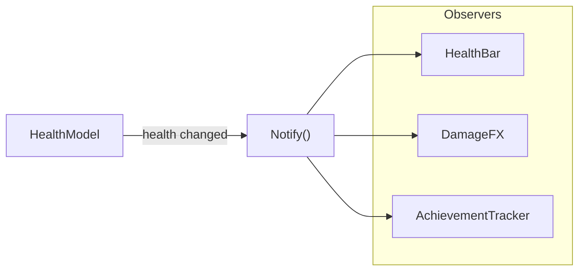

## One-line pattern summary
A reactive pattern where subscribers are automatically notified when the publisher's state changes.

## Typical Unity use cases
- When UI, sound, and achievements should all react to health changes.
- When a loosely coupled event connection is needed.

## Parts (roles)
- Subject
- Observer
- Subscribe / Unsubscribe

## Unity example (C#)
The code below is a simplified Unity example based on the scenario described above.

```csharp
using System;

public sealed class HealthModel
{
    public event Action<int, int> HealthChanged;

    public void SetHealth(int currentHealth, int maxHealth)
    {
        HealthChanged?.Invoke(currentHealth, maxHealth);
    }
}

public sealed class HealthBarPresenter
{
    public void Bind(HealthModel healthModel)
    {
        healthModel.HealthChanged += OnHealthChanged;
    }

    private void OnHealthChanged(int currentHealth, int maxHealth) { }
}
```

## Advantages
- Behavior is separated into smaller units, which reduces the impact of changes.
- Adding or swapping rules is relatively safe.

## Things to watch out for
- As the number of objects and indirect calls increases, the flow can become harder to follow.
- Ordering bugs should be pinned down with tests.

## Interaction diagram

This shows the flow where a subject state change is automatically propagated to subscribers.


