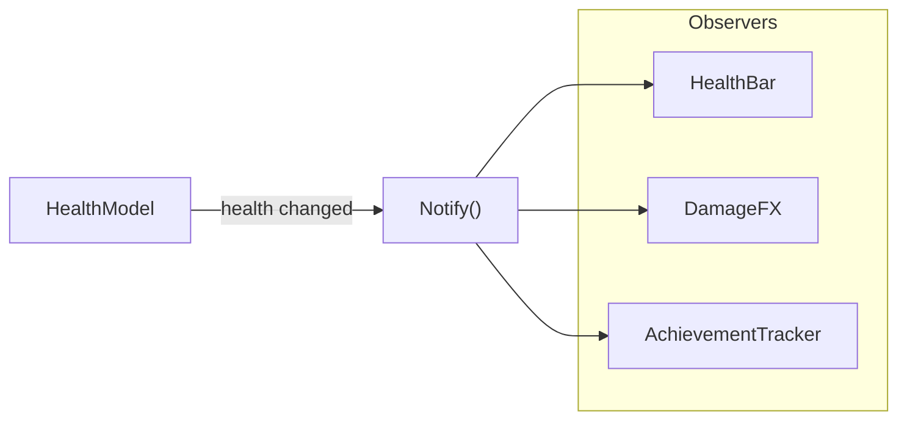

## パターンの一行要約
発行者の状態が変化したときに、購読者へ自動的に通知されるリアクティブなパターン。

## Unityでの典型的な使用例
- HP の変化に対して UI、サウンド、実績などがすべて反応すべき場合。
- 疎結合なイベント接続が必要な場合。

## 構成要素（役割）
- Subject
- Observer
- Subscribe / Unsubscribe

## Unityサンプル（C#）
以下のコードは、上記のシナリオを基にした簡略化された Unity の例です。

```csharp
using System;

public sealed class HealthModel
{
    public event Action<int, int> HealthChanged;

    public void SetHealth(int currentHealth, int maxHealth)
    {
        HealthChanged?.Invoke(currentHealth, maxHealth);
    }
}

public sealed class HealthBarPresenter
{
    public void Bind(HealthModel healthModel)
    {
        healthModel.HealthChanged += OnHealthChanged;
    }

    private void OnHealthChanged(int currentHealth, int maxHealth) { }
}
```

## 利点
- 振る舞いが小さな単位に分離されるため、変更の影響範囲を抑えられます。
- ルールの追加や差し替えが比較的安全に行えます。

## 注意点
- オブジェクト数や間接呼び出しが増えると、フローを追いにくくなります。
- 順序に関するバグはテストで確実に固めておくべきです。

## 相互作用図

Subject の状態変化が購読者へ自動的に伝播するフローを示します。


