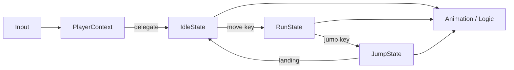

## パターンの一行要約
状態ごとに振る舞いをオブジェクトに分離し、状態遷移に応じて振る舞いを差し替えるパターン。

## Unityでの典型的な使用例
- プレイヤーの移動・戦闘ステートが増え続ける場合。
- `if-else` による状態分岐が肥大化してしまう場合。

## 構成要素（役割）
- Context
- State Interface
- Concrete State

## Unityサンプル（C#）
以下のコードは、上記のシナリオを基にした簡略化された Unity の例です。

```csharp
public interface ICharacterState
{
    void Tick(PlayerStateMachine stateMachine);
}

public sealed class IdleState : ICharacterState
{
    public void Tick(PlayerStateMachine stateMachine)
    {
        if (stateMachine.MoveInput > 0f)
        {
            stateMachine.ChangeState(new RunState());
        }
    }
}

public sealed class RunState : ICharacterState
{
    public void Tick(PlayerStateMachine stateMachine)
    {
        if (stateMachine.MoveInput <= 0f)
        {
            stateMachine.ChangeState(new IdleState());
        }
    }
}
```

## 利点
- 振る舞いが小さな単位に分離されるため、変更の影響範囲を抑えられます。
- ルールの追加や差し替えが比較的安全に行えます。

## 注意点
- オブジェクト数や間接呼び出しが増えると、フローを追いにくくなります。
- 順序に関するバグはテストで確実に固めておくべきです。

## 相互作用図

Context が現在の状態オブジェクトに処理を委譲し、遷移を行うフローを示します。


