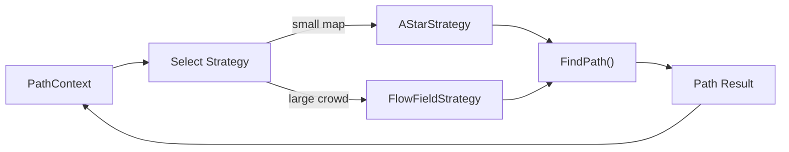

## パターンの一行要約
同じ目的を持つアルゴリズムをインターフェースの裏にカプセル化し、実行時に差し替え可能にするパターン。

## Unityでの典型的な使用例
- AI の攻撃挙動を状況に応じて変更すべき場合。
- キャラクターごとに照準や移動のポリシーが異なる場合。

## 構成要素（役割）
- Strategy Interface
- Concrete Strategy
- Context

## Unityサンプル（C#）
以下のコードは、上記のシナリオを基にした簡略化された Unity の例です。

```csharp
using UnityEngine;

public interface IAimStrategy
{
    Vector3 GetAimPosition(Transform shooterTransform, Transform targetTransform);
}

public sealed class DirectAimStrategy : IAimStrategy
{
    public Vector3 GetAimPosition(Transform shooterTransform, Transform targetTransform)
    {
        return targetTransform.position;
    }
}

public sealed class LeadAimStrategy : IAimStrategy
{
    public Vector3 GetAimPosition(Transform shooterTransform, Transform targetTransform)
    {
        return targetTransform.position + targetTransform.forward * 0.5f;
    }
}
```

## 利点
- 振る舞いが小さな単位に分離されるため、変更の影響範囲を抑えられます。
- ルールの追加や差し替えが比較的安全に行えます。

## 注意点
- オブジェクト数や間接呼び出しが増えると、フローを追いにくくなります。
- 順序に関するバグはテストで確実に固めておくべきです。

## 相互作用図

Context が Strategy インターフェースを通してアルゴリズムを差し替えるフローを示します。


