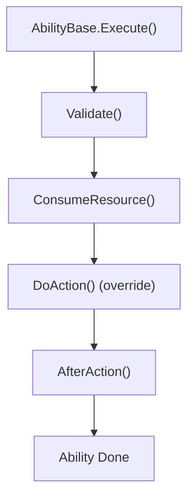

# Template Method

## パターンの一行要約
全体の手順を固定し、詳細なステップだけをサブクラスで変更するパターン。

## Unityでの典型的な使用例
- スキルの実行順序は同じだが、エフェクトが異なる場合。
- 共通の前処理・後処理を強制すべき場合。

## 構成要素（役割）
- Template Method
- Primitive Operation
- Concrete Class

## Unityサンプル（C#）
以下のコードは、上記のシナリオを基にした簡略化された Unity の例です。

```csharp
public abstract class SkillExecutionTemplate
{
    public void Execute()
    {
        if (!CanExecute())
        {
            return;
        }
        ConsumeCost();
        PlayCastAnimation();
        ApplyEffect();
    }

    protected virtual bool CanExecute() => true;

    protected virtual void ConsumeCost() { }

    protected virtual void PlayCastAnimation() { }

    protected abstract void ApplyEffect();
}

public sealed class HealSkillTemplate : SkillExecutionTemplate
{
    protected override void ApplyEffect()
    {
        // Heal target.
    }
}
```

## 利点
- 振る舞いが小さな単位に分離されるため、変更の影響範囲を抑えられます。
- ルールの追加や差し替えが比較的安全に行えます。

## 注意点
- オブジェクト数や間接呼び出しが増えると、フローを追いにくくなります。
- 順序に関するバグはテストで確実に固めておくべきです。

## 相互作用図

親クラスがアルゴリズムの順序を固定し、サブクラスが一部のステップだけを変更するフローを示します。


