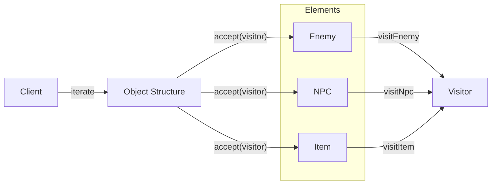

## One-line pattern summary
A pattern that separates operations into visitors so the object structure can be extended without modifying it.

## Typical Unity use cases
- When adding statistics or reward calculations across many unit types.
- When the structure is fixed but operations increase often.

## Parts (roles)
- Visitor
- Element
- Accept

## Unity example (C#)
The code below is a simplified Unity example based on the scenario described above.

```csharp
public interface IUnitVisitor
{
    void Visit(PlayerUnit playerUnit);
    void Visit(EnemyUnit enemyUnit);
}

public interface IVisitableUnit
{
    void Accept(IUnitVisitor visitor);
}

public sealed class DamagePreviewVisitor : IUnitVisitor
{
    public int TotalPreviewDamage { get; private set; }

    public void Visit(PlayerUnit playerUnit) => TotalPreviewDamage += 5;
    public void Visit(EnemyUnit enemyUnit) => TotalPreviewDamage += 10;
}
```

## Advantages
- Behavior is separated into smaller units, which reduces the impact of changes.
- Adding or swapping rules is relatively safe.

## Things to watch out for
- As the number of objects and indirect calls increases, the flow can become harder to follow.
- Ordering bugs should be pinned down with tests.

## Interaction diagram

This shows the flow where the object structure is traversed and operations are delegated to a visitor.


