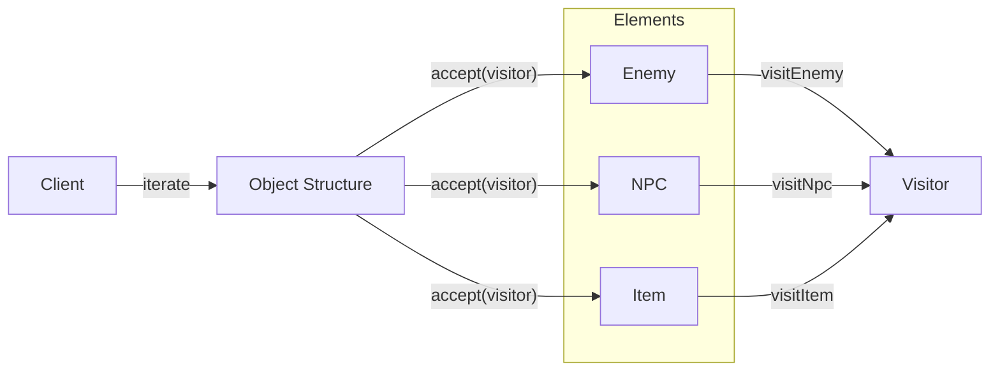

## パターンの一行要約
操作を Visitor に分離し、オブジェクト構造を修正することなく拡張できるようにするパターン。

## Unityでの典型的な使用例
- 多数のユニット種別に対して統計や報酬計算を追加する場合。
- 構造は固定されているが、操作が頻繁に増える場合。

## 構成要素（役割）
- Visitor
- Element
- Accept

## Unityサンプル（C#）
以下のコードは、上記のシナリオを基にした簡略化された Unity の例です。

```csharp
public interface IUnitVisitor
{
    void Visit(PlayerUnit playerUnit);
    void Visit(EnemyUnit enemyUnit);
}

public interface IVisitableUnit
{
    void Accept(IUnitVisitor visitor);
}

public sealed class DamagePreviewVisitor : IUnitVisitor
{
    public int TotalPreviewDamage { get; private set; }

    public void Visit(PlayerUnit playerUnit) => TotalPreviewDamage += 5;
    public void Visit(EnemyUnit enemyUnit) => TotalPreviewDamage += 10;
}
```

## 利点
- 振る舞いが小さな単位に分離されるため、変更の影響範囲を抑えられます。
- ルールの追加や差し替えが比較的安全に行えます。

## 注意点
- オブジェクト数や間接呼び出しが増えると、フローを追いにくくなります。
- 順序に関するバグはテストで確実に固めておくべきです。

## 相互作用図

オブジェクト構造を走査し、操作を Visitor に委譲するフローを示します。


