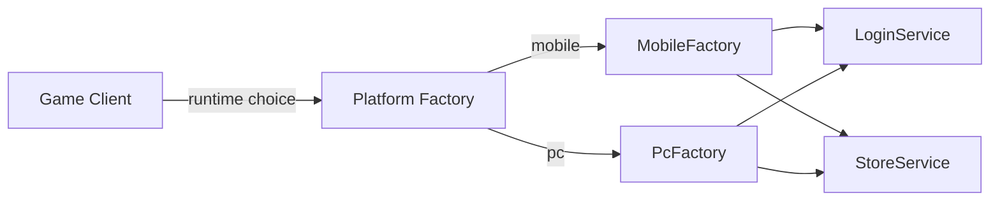

# Abstract Factory

## One-line pattern summary
A pattern that creates related groups of objects without depending on concrete types.

## Typical Unity use cases
- When replacing an entire set of platform-specific services.
- When separating test product families.

## Parts (roles)
- Abstract Factory
- Concrete Factory
- Abstract Product

## Unity example (C#)
The code below is a simplified Unity example based on the scenario described above.

```csharp
public interface IPlatformServiceFactory
{
    ILoginService CreateLoginService();
    IStoreService CreateStoreService();
}

public sealed class MobilePlatformServiceFactory : IPlatformServiceFactory
{
    public ILoginService CreateLoginService() => new MobileLoginService();
    public IStoreService CreateStoreService() => new MobileStoreService();
}

public sealed class PcPlatformServiceFactory : IPlatformServiceFactory
{
    public ILoginService CreateLoginService() => new PcLoginService();
    public IStoreService CreateStoreService() => new PcStoreService();
}
```

## Advantages
- Object creation responsibilities are well organized, which makes dependency management easier.
- Creation policies can be changed flexibly by environment or situation.

## Things to watch out for
- Avoid introducing overly abstract creation layers for simple problems.
- As creation rules increase, keeping documentation and tests in sync becomes more important.

## Interaction diagram

This shows the flow where platform-specific product families are created behind the same interface.


