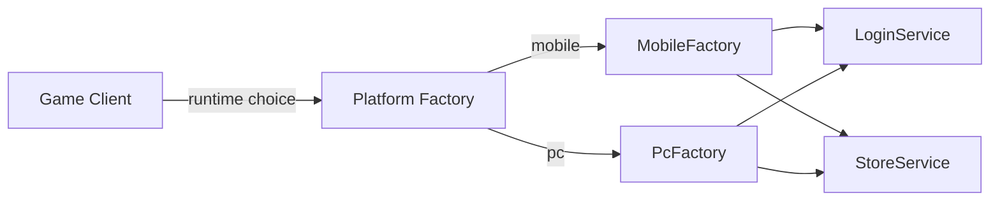

# Abstract Factory

## パターンの一行要約
具象型に依存することなく、関連するオブジェクト群を生成するパターンです。

## Unityでの典型的な使用例
- プラットフォーム固有のサービスをまとめて差し替える場合。
- テスト用のプロダクトファミリーを分離する場合。

## 構成要素（役割）
- Abstract Factory
- Concrete Factory
- Abstract Product

## Unityサンプル（C#）
以下のコードは、上記のシナリオに基づいた簡略化されたUnityのサンプルです。

```csharp
public interface IPlatformServiceFactory
{
    ILoginService CreateLoginService();
    IStoreService CreateStoreService();
}

public sealed class MobilePlatformServiceFactory : IPlatformServiceFactory
{
    public ILoginService CreateLoginService() => new MobileLoginService();
    public IStoreService CreateStoreService() => new MobileStoreService();
}

public sealed class PcPlatformServiceFactory : IPlatformServiceFactory
{
    public ILoginService CreateLoginService() => new PcLoginService();
    public IStoreService CreateStoreService() => new PcStoreService();
}
```

## メリット
- オブジェクト生成の責務が整理され、依存関係の管理が容易になります。
- 環境や状況に応じて生成ポリシーを柔軟に変更できます。

## 注意点
- 単純な問題に対して、過度に抽象的な生成レイヤーを導入することは避けましょう。
- 生成ルールが増えるにつれて、ドキュメントとテストの同期を保つことがより重要になります。

## 相互作用図

同じインターフェースの背後で、プラットフォーム固有のプロダクトファミリーを生成する流れを示しています。


