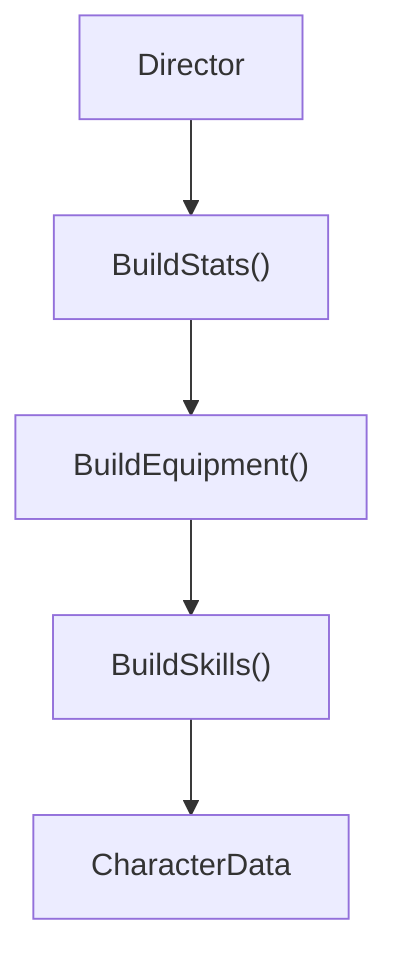

## パターンの一行要約
複雑なオブジェクトの生成をステップごとに分離し、可読性と安全性を向上させるパターンです。

## Unityでの典型的な使用例
- 多くのオプションを持つ設定オブジェクトを生成する場合。
- 同じプロセスから異なる結果を生成する場合。

## 構成要素（役割）
- Builder
- Director（オプション）
- Product

## Unityサンプル（C#）
以下のコードは、上記のシナリオに基づいた簡略化されたUnityのサンプルです。

```csharp
public sealed class EnemyWaveConfig
{
    public int EnemyCount;
    public float SpawnIntervalSeconds;
    public string RewardId;
}

public sealed class EnemyWaveBuilder
{
    private readonly EnemyWaveConfig waveConfig = new();

    public EnemyWaveBuilder SetEnemyCount(int enemyCount)
    {
        waveConfig.EnemyCount = enemyCount;
        return this;
    }

    public EnemyWaveBuilder SetSpawnInterval(float spawnIntervalSeconds)
    {
        waveConfig.SpawnIntervalSeconds = spawnIntervalSeconds;
        return this;
    }

    public EnemyWaveBuilder SetReward(string rewardId)
    {
        waveConfig.RewardId = rewardId;
        return this;
    }

    public EnemyWaveConfig Build() => waveConfig;
}
```

## メリット
- オブジェクト生成の責務が整理され、依存関係の管理が容易になります。
- 環境や状況に応じて生成ポリシーを柔軟に変更できます。

## 注意点
- 単純な問題に対して、過度に抽象的な生成レイヤーを導入することは避けましょう。
- 生成ルールが増えるにつれて、ドキュメントとテストの同期を保つことがより重要になります。

## 相互作用図

複雑なオブジェクトをステップごとに組み立て、最後に返却する流れを示しています。


