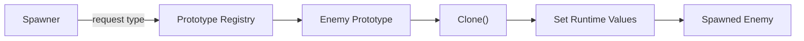

## パターンの一行要約
コンストラクタを呼び出す代わりに、既存のプロトタイプを複製して新しいオブジェクトを生成するパターンです。

## Unityでの典型的な使用例
- モンスターのテンプレートを複製してランタイムインスタンスを生成する場合。
- 生成コストの高いオブジェクトを高速に複製する場合。

## 構成要素（役割）
- Prototype
- Clone
- Prototype Registry

## Unityサンプル（C#）
以下のコードは、上記のシナリオに基づいた簡略化されたUnityのサンプルです。

```csharp
using UnityEngine;

[CreateAssetMenu(menuName = "Game/Enemy Archetype Data")]
public sealed class EnemyArchetypeData : ScriptableObject
{
    public int baseHealth;
    public float moveSpeed;

    public EnemyRuntimeData CloneRuntimeData()
    {
        return new EnemyRuntimeData(baseHealth, moveSpeed);
    }
}

public sealed class EnemyRuntimeData
{
    public int CurrentHealth;
    public float CurrentMoveSpeed;

    public EnemyRuntimeData(int currentHealth, float currentMoveSpeed)
    {
        CurrentHealth = currentHealth;
        CurrentMoveSpeed = currentMoveSpeed;
    }
}
```

## メリット
- オブジェクト生成の責務が整理され、依存関係の管理が容易になります。
- 環境や状況に応じて生成ポリシーを柔軟に変更できます。

## 注意点
- 単純な問題に対して、過度に抽象的な生成レイヤーを導入することは避けましょう。
- 生成ルールが増えるにつれて、ドキュメントとテストの同期を保つことがより重要になります。

## 相互作用図

登録されたプロトタイプを複製し、ランタイム値でカスタマイズする流れを示しています。


