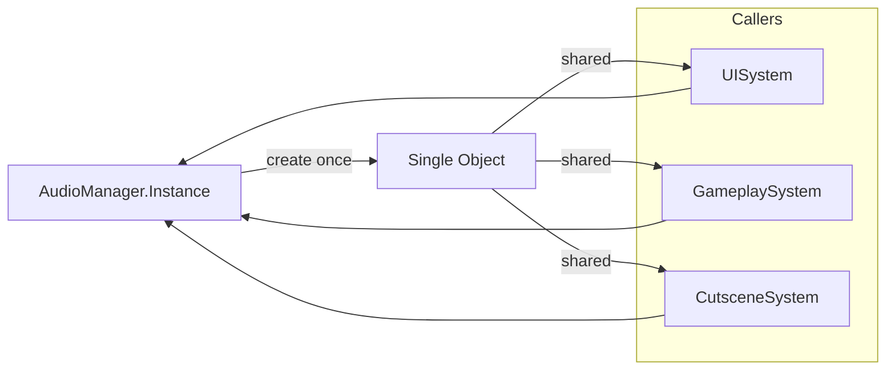

## One-line pattern summary
A pattern that keeps a single instance and provides a global access point.

## Typical Unity use cases
- When a single service such as game settings or logging is required.
- When using managers that persist across scenes.

## Parts (roles)
- Singleton Instance
- Global Accessor
- Lifetime Guard

## Unity example (C#)
The code below is a simplified Unity example based on the scenario described above.

```csharp
using UnityEngine;

public sealed class GameSettingsService : MonoBehaviour
{
    public static GameSettingsService Instance { get; private set; }

    private void Awake()
    {
        if (Instance != null && Instance != this)
        {
            Destroy(gameObject);
            return;
        }
        Instance = this;
        DontDestroyOnLoad(gameObject);
    }
}
```

## Advantages
- Object creation responsibilities are well organized, which makes dependency management easier.
- Creation policies can be changed flexibly by environment or situation.

## Things to watch out for
- Avoid introducing overly abstract creation layers for simple problems.
- As creation rules increase, keeping documentation and tests in sync becomes more important.

## Interaction diagram

This shows the flow where many callers share the same instance.


