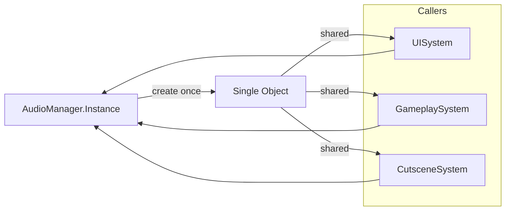

## パターンの一行要約
唯一のインスタンスを保持し、グローバルなアクセスポイントを提供するパターンです。

## Unityでの典型的な使用例
- ゲーム設定やロギングなど、単一のサービスが必要な場合。
- シーンをまたいで存続するマネージャーを使用する場合。

## 構成要素（役割）
- Singleton Instance
- Global Accessor
- Lifetime Guard

## Unityサンプル（C#）
以下のコードは、上記のシナリオに基づいた簡略化されたUnityのサンプルです。

```csharp
using UnityEngine;

public sealed class GameSettingsService : MonoBehaviour
{
    public static GameSettingsService Instance { get; private set; }

    private void Awake()
    {
        if (Instance != null && Instance != this)
        {
            Destroy(gameObject);
            return;
        }
        Instance = this;
        DontDestroyOnLoad(gameObject);
    }
}
```

## メリット
- オブジェクト生成の責務が整理され、依存関係の管理が容易になります。
- 環境や状況に応じて生成ポリシーを柔軟に変更できます。

## 注意点
- 単純な問題に対して、過度に抽象的な生成レイヤーを導入することは避けましょう。
- 生成ルールが増えるにつれて、ドキュメントとテストの同期を保つことがより重要になります。

## 相互作用図

複数の呼び出し元が同じインスタンスを共有する流れを示しています。


