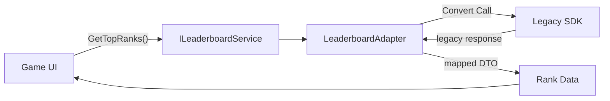

## パターンの一行要約
互換性のない既存のインターフェースを、現在のシステムが期待するインターフェースに変換するパターンです。

## Unityでの典型的な使用例
- レガシーや外部SDKをプロジェクトの標準APIに合わせる場合。
- 既存の実装を修正せずに再利用したい場合。

## 構成要素（役割）
- Target
- Adaptee
- Adapter

## Unityサンプル（C#）
以下のコードは、上記のシナリオに基づいて簡略化したUnityのサンプルです。

```csharp
public interface IAdsService
{
    void ShowRewardedAd(string placementId);
}

public sealed class LegacyAdsSdk
{
    public void ShowRewardVideo(string zoneId) { }
}

public sealed class LegacyAdsServiceAdapter : IAdsService
{
    private readonly LegacyAdsSdk legacyAdsSdk = new();

    public void ShowRewardedAd(string placementId)
    {
        legacyAdsSdk.ShowRewardVideo(placementId);
    }
}
```

## 利点
- モジュールの境界が明確になり、結合度を下げられます。
- 既存コードを修正せずに機能を拡張・統合できます。

## 注意点
- ラッパー層が深くなりすぎると、デバッグが困難になります。
- 責任の境界が曖昧にならないよう、インターフェースは小さく保つべきです。

## 相互作用図

既存のインターフェースをターゲットインターフェースに変換して再利用する流れを示しています。


