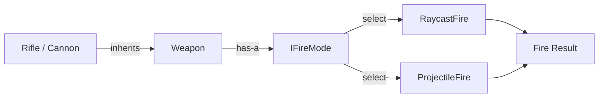

## One-line pattern summary
A pattern that separates abstraction and implementation so both can be extended independently.

## Typical Unity use cases
- When separating input device implementations from control logic.
- When swapping platform-specific backend implementations.

## Parts (roles)
- Abstraction
- Implementor
- Concrete Implementor

## Unity example (C#)
The code below is a simplified Unity example based on the scenario described above.

```csharp
using UnityEngine;

public interface IInputReader
{
    Vector2 ReadMovement();
}

public sealed class KeyboardInputReader : IInputReader
{
    public Vector2 ReadMovement()
    {
        float horizontal = Input.GetAxisRaw("Horizontal");
        float vertical = Input.GetAxisRaw("Vertical");
        return new Vector2(horizontal, vertical);
    }
}

public sealed class CharacterMovementController
{
    private readonly IInputReader inputReader;

    public CharacterMovementController(IInputReader inputReader)
    {
        this.inputReader = inputReader;
    }

    public Vector2 GetMoveDirection() => inputReader.ReadMovement();
}
```

## Advantages
- It clarifies module boundaries and reduces coupling.
- Features can be extended or integrated without modifying existing code.

## Things to watch out for
- If wrapper layers become too deep, debugging gets harder.
- Interfaces should stay small so responsibility boundaries do not blur.

## Interaction diagram

This shows the delegation flow where abstraction and implementation are separated and extended independently.


