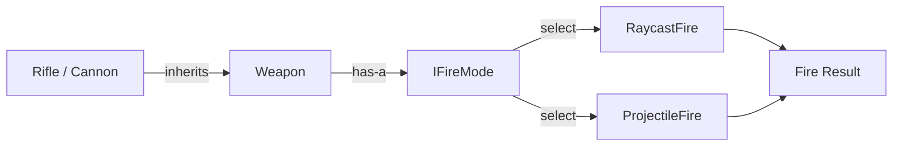

## パターンの一行要約
抽象と実装を分離し、両者を独立して拡張できるようにするパターンです。

## Unityでの典型的な使用例
- 入力デバイスの実装と操作ロジックを分離する場合。
- プラットフォーム別のバックエンド実装を差し替える場合。

## 構成要素（役割）
- Abstraction
- Implementor
- Concrete Implementor

## Unityサンプル（C#）
以下のコードは、上記のシナリオに基づいて簡略化したUnityのサンプルです。

```csharp
using UnityEngine;

public interface IInputReader
{
    Vector2 ReadMovement();
}

public sealed class KeyboardInputReader : IInputReader
{
    public Vector2 ReadMovement()
    {
        float horizontal = Input.GetAxisRaw("Horizontal");
        float vertical = Input.GetAxisRaw("Vertical");
        return new Vector2(horizontal, vertical);
    }
}

public sealed class CharacterMovementController
{
    private readonly IInputReader inputReader;

    public CharacterMovementController(IInputReader inputReader)
    {
        this.inputReader = inputReader;
    }

    public Vector2 GetMoveDirection() => inputReader.ReadMovement();
}
```

## 利点
- モジュールの境界が明確になり、結合度を下げられます。
- 既存コードを修正せずに機能を拡張・統合できます。

## 注意点
- ラッパー層が深くなりすぎると、デバッグが困難になります。
- 責任の境界が曖昧にならないよう、インターフェースは小さく保つべきです。

## 相互作用図

抽象と実装を分離し、独立して拡張する委譲の流れを示しています。


