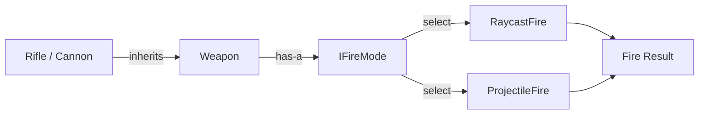

## 패턴 한 줄 설명
추상화와 구현을 분리해 양쪽을 독립적으로 확장하는 패턴입니다.

## Unity에서 쓰는 대표 상황
- 입력 장치 구현을 조작 로직과 분리할 때
- 플랫폼별 백엔드 구현을 교체할 때

## 구성 요소 (역할)
- Abstraction
- Implementor
- Concrete Implementor

## Unity 예시 (C#)
아래 코드는 위에서 설명한 대표 상황을 Unity 프로젝트 맥락으로 단순화한 예시입니다.

```csharp
using UnityEngine;

public interface IInputReader
{
    Vector2 ReadMovement();
}

public sealed class KeyboardInputReader : IInputReader
{
    public Vector2 ReadMovement()
    {
        float horizontal = Input.GetAxisRaw("Horizontal");
        float vertical = Input.GetAxisRaw("Vertical");
        return new Vector2(horizontal, vertical);
    }
}

public sealed class CharacterMovementController
{
    private readonly IInputReader inputReader;

    public CharacterMovementController(IInputReader inputReader)
    {
        this.inputReader = inputReader;
    }

    public Vector2 GetMoveDirection() => inputReader.ReadMovement();
}
```

## 장점
- 모듈 경계를 명확히 해 결합도를 낮출 수 있습니다.
- 기존 코드 수정 없이 기능 확장/통합이 쉬워집니다.

## 주의할 점
- 래퍼/어댑터 계층이 깊어지면 디버깅이 어려워집니다.
- 책임 경계가 흐려지지 않도록 인터페이스를 작게 유지해야 합니다.

## 동작 다이어그램

추상화와 구현을 분리해 각각 독립 확장하는 위임 흐름입니다.


