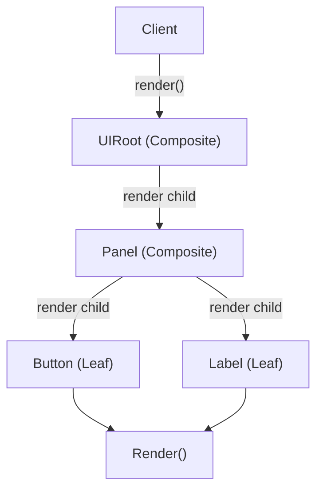

## パターンの一行要約
個別のオブジェクトと合成されたオブジェクトを同一のインターフェースで扱うツリー構造のパターンです。

## Unityでの典型的な使用例
- クエスト目標をツリー構造で構築する場合。
- ノードとグループノードのオブジェクトを同じ方法で扱う場合。

## 構成要素（役割）
- Component
- Leaf
- Composite

## Unityサンプル（C#）
以下のコードは、上記のシナリオに基づいて簡略化したUnityのサンプルです。

```csharp
using System.Collections.Generic;

public interface IQuestCondition
{
    bool IsCompleted();
}

public sealed class KillMonsterCondition : IQuestCondition
{
    public bool IsCompleted() => false;
}

public sealed class AllConditionsGroup : IQuestCondition
{
    private readonly List<IQuestCondition> childConditions = new();

    public void Add(IQuestCondition childCondition)
    {
        childConditions.Add(childCondition);
    }

    public bool IsCompleted()
    {
        foreach (IQuestCondition childCondition in childConditions)
        {
            if (!childCondition.IsCompleted())
            {
                return false;
            }
        }
        return true;
    }
}
```

## 利点
- モジュールの境界が明確になり、結合度を下げられます。
- 既存コードを修正せずに機能を拡張・統合できます。

## 注意点
- ラッパー層が深くなりすぎると、デバッグが困難になります。
- 責任の境界が曖昧にならないよう、インターフェースは小さく保つべきです。

## 相互作用図

単一オブジェクトとコンポジットの両方を同一のインターフェースで扱う再帰的な流れを示しています。


