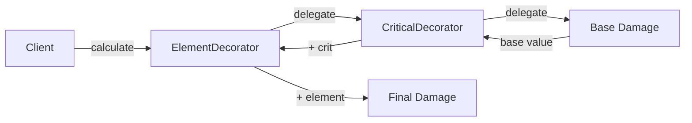

## One-line pattern summary
A pattern that dynamically adds functionality at runtime through wrappers that surround an object.

## Typical Unity use cases
- When applying weapon attributes in a composable way.
- When extending functionality without touching existing code.

## Parts (roles)
- Component
- Decorator Base
- Concrete Decorator

## Unity example (C#)
The code below is a simplified Unity example based on the scenario described above.

```csharp
public interface IWeaponDamageCalculator
{
    int CalculateDamage();
}

public sealed class BaseWeaponDamageCalculator : IWeaponDamageCalculator
{
    public int CalculateDamage() => 10;
}

public abstract class WeaponDamageDecorator : IWeaponDamageCalculator
{
    protected readonly IWeaponDamageCalculator innerCalculator;

    protected WeaponDamageDecorator(IWeaponDamageCalculator innerCalculator)
    {
        this.innerCalculator = innerCalculator;
    }

    public abstract int CalculateDamage();
}

public sealed class FireDamageDecorator : WeaponDamageDecorator
{
    public FireDamageDecorator(IWeaponDamageCalculator innerCalculator) : base(innerCalculator) { }

    public override int CalculateDamage() => innerCalculator.CalculateDamage() + 5;
}
```

## Advantages
- It clarifies module boundaries and reduces coupling.
- Features can be extended or integrated without modifying existing code.

## Things to watch out for
- If wrapper layers become too deep, debugging gets harder.
- Interfaces should stay small so responsibility boundaries do not blur.

## Interaction diagram

This shows the chain where functionality is added dynamically through wrappers.


