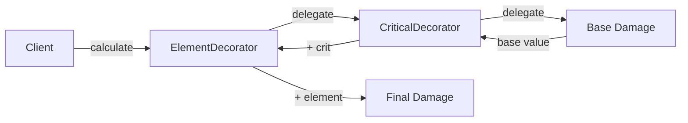

## パターンの一行要約
オブジェクトを取り囲むラッパーを通じて、実行時に動的に機能を追加するパターンです。

## Unityでの典型的な使用例
- 武器の属性を組み合わせ可能な形で適用する場合。
- 既存コードに手を加えずに機能を拡張する場合。

## 構成要素（役割）
- Component
- Decorator Base
- Concrete Decorator

## Unityサンプル（C#）
以下のコードは、上記のシナリオに基づいて簡略化したUnityのサンプルです。

```csharp
public interface IWeaponDamageCalculator
{
    int CalculateDamage();
}

public sealed class BaseWeaponDamageCalculator : IWeaponDamageCalculator
{
    public int CalculateDamage() => 10;
}

public abstract class WeaponDamageDecorator : IWeaponDamageCalculator
{
    protected readonly IWeaponDamageCalculator innerCalculator;

    protected WeaponDamageDecorator(IWeaponDamageCalculator innerCalculator)
    {
        this.innerCalculator = innerCalculator;
    }

    public abstract int CalculateDamage();
}

public sealed class FireDamageDecorator : WeaponDamageDecorator
{
    public FireDamageDecorator(IWeaponDamageCalculator innerCalculator) : base(innerCalculator) { }

    public override int CalculateDamage() => innerCalculator.CalculateDamage() + 5;
}
```

## 利点
- モジュールの境界が明確になり、結合度を下げられます。
- 既存コードを修正せずに機能を拡張・統合できます。

## 注意点
- ラッパー層が深くなりすぎると、デバッグが困難になります。
- 責任の境界が曖昧にならないよう、インターフェースは小さく保つべきです。

## 相互作用図

ラッパーを通じて動的に機能が追加されるチェーンを示しています。


