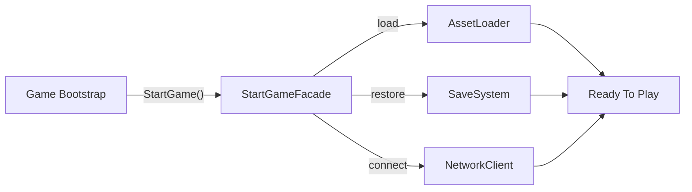

## パターンの一行要約
複雑なサブシステムをシンプルな上位APIで包み、使いやすさを向上させるパターンです。

## Unityでの典型的な使用例
- ゲームの起動シーケンスを1つのメソッドの裏に隠す場合。
- 内部モジュールの詳細を外部から隠したい場合。

## 構成要素（役割）
- Facade
- Subsystem
- Client

## Unityサンプル（C#）
以下のコードは、上記のシナリオに基づいて簡略化したUnityのサンプルです。

```csharp
public sealed class GameStartupFacade
{
    private readonly SaveSystem saveSystem = new();
    private readonly AudioSystem audioSystem = new();
    private readonly UiSystem uiSystem = new();

    public void StartGame()
    {
        saveSystem.Load();
        audioSystem.Initialize();
        uiSystem.OpenLobby();
    }
}
```

## 利点
- モジュールの境界が明確になり、結合度を下げられます。
- 既存コードを修正せずに機能を拡張・統合できます。

## 注意点
- ラッパー層が深くなりすぎると、デバッグが困難になります。
- 責任の境界が曖昧にならないよう、インターフェースは小さく保つべきです。

## 相互作用図

複雑なサブシステムの呼び出しを単一のエントリーポイントへ簡素化する流れを示しています。


