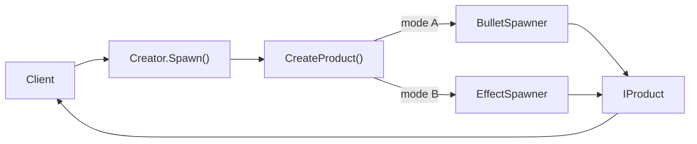

# Factory Method

## One-line pattern summary
A pattern that delegates the actual creation responsibility of a factory method to subclasses.

## Typical Unity use cases
- When projectile creation rules differ by weapon type.
- When type-specific initialization logic should be separated.

## Parts (roles)
- Creator
- Concrete Creator
- Product

## Unity example (C#)
The code below is a simplified Unity example based on the scenario described above.

```csharp
using UnityEngine;

public interface IProjectile
{
    void Fire(Vector3 startPosition, Vector3 direction);
}

public abstract class ProjectileSpawner : MonoBehaviour
{
    public void Shoot(Vector3 startPosition, Vector3 direction)
    {
        IProjectile projectile = CreateProjectile();
        projectile.Fire(startPosition, direction);
    }

    protected abstract IProjectile CreateProjectile();
}
```

## Advantages
- It clarifies module boundaries and reduces coupling.
- Features can be extended or integrated without modifying existing code.

## Things to watch out for
- If wrapper layers become too deep, debugging gets harder.
- Interfaces should stay small so responsibility boundaries do not blur.

## Interaction diagram

This shows the flow where the parent keeps the creation procedure while subclasses choose the actual type.


