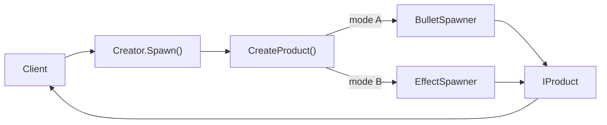

# Factory Method

## パターンの一行要約
ファクトリメソッドの実際の生成責任をサブクラスに委譲するパターンです。

## Unityでの典型的な使用例
- 武器タイプごとに弾丸の生成ルールが異なる場合。
- 型ごとの初期化ロジックを分離したい場合。

## 構成要素（役割）
- Creator
- Concrete Creator
- Product

## Unityサンプル（C#）
以下のコードは、上記のシナリオに基づいて簡略化したUnityのサンプルです。

```csharp
using UnityEngine;

public interface IProjectile
{
    void Fire(Vector3 startPosition, Vector3 direction);
}

public abstract class ProjectileSpawner : MonoBehaviour
{
    public void Shoot(Vector3 startPosition, Vector3 direction)
    {
        IProjectile projectile = CreateProjectile();
        projectile.Fire(startPosition, direction);
    }

    protected abstract IProjectile CreateProjectile();
}
```

## 利点
- モジュールの境界が明確になり、結合度を下げられます。
- 既存コードを修正せずに機能を拡張・統合できます。

## 注意点
- ラッパー層が深くなりすぎると、デバッグが困難になります。
- 責任の境界が曖昧にならないよう、インターフェースは小さく保つべきです。

## 相互作用図

親が生成手順を保持し、サブクラスが実際の型を選択する流れを示しています。


