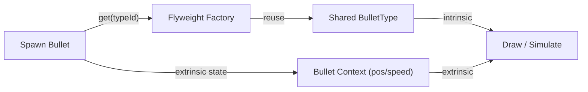

## パターンの一行要約
共有可能な不変状態を再利用することで、大量のオブジェクトのメモリ使用量を削減するパターンです。

## Unityでの典型的な使用例
- 多数のインスタンスが同じビジュアルリソースを共有する場合。
- タイル、アイコン、弾丸などのデータに大量の重複が含まれる場合。

## 構成要素（役割）
- Flyweight
- Factory (Cache)
- Intrinsic / Extrinsic State

## Unityサンプル（C#）
以下のコードは、上記のシナリオに基づいて簡略化したUnityのサンプルです。

```csharp
using System.Collections.Generic;
using UnityEngine;

public sealed class ProjectileVisualFlyweight
{
    public readonly Sprite Sprite;

    public ProjectileVisualFlyweight(Sprite sprite)
    {
        Sprite = sprite;
    }
}

public sealed class ProjectileVisualFlyweightFactory
{
    private readonly Dictionary<string, ProjectileVisualFlyweight> cachedVisuals = new();

    public ProjectileVisualFlyweight Get(string visualKey, Sprite sprite)
    {
        if (!cachedVisuals.TryGetValue(visualKey, out ProjectileVisualFlyweight flyweight))
        {
            flyweight = new ProjectileVisualFlyweight(sprite);
            cachedVisuals.Add(visualKey, flyweight);
        }
        return flyweight;
    }
}
```

## 利点
- モジュールの境界が明確になり、結合度を下げられます。
- 既存コードを修正せずに機能を拡張・統合できます。

## 注意点
- ラッパー層が深くなりすぎると、デバッグが困難になります。
- 責任の境界が曖昧にならないよう、インターフェースは小さく保つべきです。

## 相互作用図

共有可能な内的状態を再利用しつつ、外的状態をコンテキストから注入する流れを示しています。


