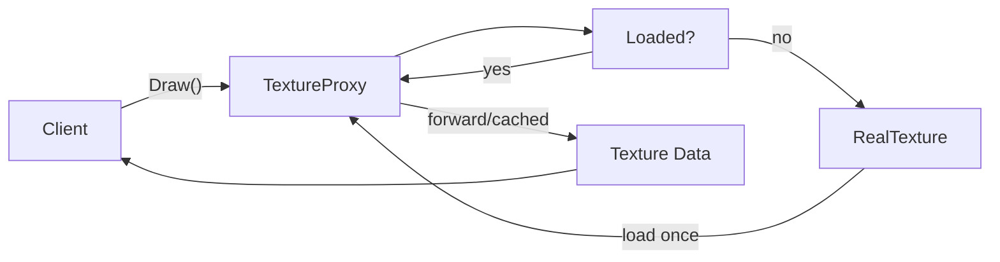

## One-line pattern summary
A pattern that places a surrogate object in front of the real object to handle control, lazy loading, or caching.

## Typical Unity use cases
- When lazily loading heavy resources.
- When cache or permission checks are needed before remote calls.

## Parts (roles)
- Subject
- Real Subject
- Proxy

## Unity example (C#)
The code below is a simplified Unity example based on the scenario described above.

```csharp
using System.Collections.Generic;

public interface IRemoteInventoryService
{
    IReadOnlyList<string> GetItemIds();
}

public sealed class CachingInventoryProxy : IRemoteInventoryService
{
    private readonly IRemoteInventoryService remoteService;
    private IReadOnlyList<string> cachedItemIds;

    public CachingInventoryProxy(IRemoteInventoryService remoteService)
    {
        this.remoteService = remoteService;
    }

    public IReadOnlyList<string> GetItemIds()
    {
        cachedItemIds ??= remoteService.GetItemIds();
        return cachedItemIds;
    }
}
```

## Advantages
- It clarifies module boundaries and reduces coupling.
- Features can be extended or integrated without modifying existing code.

## Things to watch out for
- If wrapper layers become too deep, debugging gets harder.
- Interfaces should stay small so responsibility boundaries do not blur.

## Interaction diagram

This shows the flow where a proxy handles access control, lazy loading, and caching.


