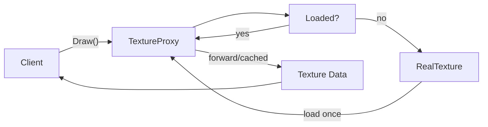

## パターンの一行要約
実オブジェクトの前に代理オブジェクトを置き、制御・遅延ロード・キャッシュを担うパターンです。

## Unityでの典型的な使用例
- 重いリソースを遅延ロードする場合。
- リモート呼び出しの前にキャッシュや権限チェックが必要な場合。

## 構成要素（役割）
- Subject
- Real Subject
- Proxy

## Unityサンプル（C#）
以下のコードは、上記のシナリオに基づいて簡略化したUnityのサンプルです。

```csharp
using System.Collections.Generic;

public interface IRemoteInventoryService
{
    IReadOnlyList<string> GetItemIds();
}

public sealed class CachingInventoryProxy : IRemoteInventoryService
{
    private readonly IRemoteInventoryService remoteService;
    private IReadOnlyList<string> cachedItemIds;

    public CachingInventoryProxy(IRemoteInventoryService remoteService)
    {
        this.remoteService = remoteService;
    }

    public IReadOnlyList<string> GetItemIds()
    {
        cachedItemIds ??= remoteService.GetItemIds();
        return cachedItemIds;
    }
}
```

## 利点
- モジュールの境界が明確になり、結合度を下げられます。
- 既存コードを修正せずに機能を拡張・統合できます。

## 注意点
- ラッパー層が深くなりすぎると、デバッグが困難になります。
- 責任の境界が曖昧にならないよう、インターフェースは小さく保つべきです。

## 相互作用図

プロキシがアクセス制御、遅延ロード、キャッシュを処理する流れを示しています。


